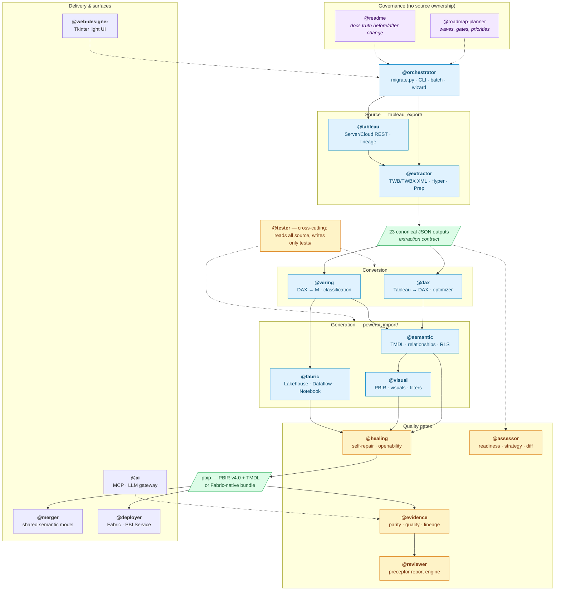
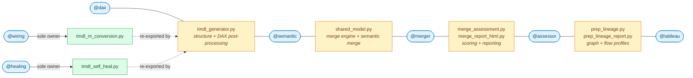

# Multi-Agent Architecture — Tableau to Power BI Migration

This project uses a **17-agent implementation specialization model**, plus
`@roadmap-planner` for planning and `@readme` as the documentation quality gate.
Each implementation agent has scoped domain knowledge, file ownership, and clear
boundaries. Four specialist agents (@dax, @wiring, @semantic, @visual) provide deep
conversion expertise; **@healing**, **@evidence**, **@fabric** and **@ai** own the
self-repair, quality-evidence, Fabric-native and agent-facing surfaces; **@tableau**
handles Tableau Server/Cloud interaction, **@reviewer** owns the preceptor scoring
engine and coaching reports, and **@web-designer** owns the end-user UI surfaces.
The CLI does not dispatch that coaching to a Copilot agent.

All agents should use [ROADMAP.md](ROADMAP.md) as the source of truth for the
next work. Do not describe the Fabric-native output as production-ready until
its release criteria pass.

## Quick Reference

| Agent | Invoke When | Owns |
|-------|-------------|------|
| **@orchestrator** | Pipeline coordination, CLI, batch, wizard | `migrate.py`, `import_to_powerbi.py`, `wizard.py`, `progress.py`, `incremental.py`, `plugins.py`, `notebook_api.py`, `api_server.py` |
| **@extractor** | Parsing Tableau XML (.twb/.twbx), Hyper files, Prep flow conversion | `tableau_export/extract_tableau_data.py`, `datasource_extractor.py`, `hyper_reader.py`, `pulse_extractor.py`, `prep_flow_parser.py` |
| **@tableau** | Tableau Server/Cloud REST API, JWT auth, site discovery, permissions, metadata lineage, Prep flow analysis | `tableau_export/server_client.py`, `tableau_export/prep_flow_analyzer.py` |
| **@dax** | DAX formula correctness, conversion, optimization, aggregation context, cross-table refs | `dax_converter.py`, `dax_optimizer.py` + DAX post-processing in `tmdl_generator.py` |
| **@wiring** | DAX↔M bridge, calc column vs measure classification, M generation, M step injection | `m_query_builder.py`, `calc_column_utils.py`, `tmdl_m_conversion.py` |
| **@semantic** | TMDL semantic model, relationships, Calendar, RLS, hierarchies, parameters | `tmdl_generator.py` (structural), `fabric_semantic_model_generator.py` |
| **@visual** | PBIR report, visual containers, slicers, filters, bookmarks, themes, pages | `pbip_generator.py`, `visual_generator.py` |
| **@healing** | Self-repair subsystem, openability preflight, recovery ledger, rollback gate | `healing*.py`, `autoheal.py`, `dax_healing.py`, `m_healing.py`, `visual_healing.py`, `openability.py`, `self_healing_v3.py`, `tmdl_self_heal.py` |
| **@evidence** | Quality reports, evidence packages, parity scoring, diff/coverage tooling | `migration_quality.py`, `parity_registry.py`, `evidence_*.py`, `*_diff.py`, `html_template.py`, `quality_grades.py` |
| **@fabric** | Fabric-native artifacts (Lakehouse, Dataflow Gen2, Notebook, DirectLake, Pipeline) | `fabric_*.py`, `lakehouse_generator.py`, `dataflow_generator.py`, `notebook_generator.py`, `pipeline_generator.py` |
| **@ai** | MCP server, LLM gateway, conversational Q&A, remediation, plugin SDK, marketplace | `mcp_server.py`, `llm_gateway.py`, `conversational.py`, `remediation.py`, `plugin_sdk.py`, `marketplace.py` |
| **@assessor** | Migration readiness, scoring, strategy, diff reports, validation | `assessment.py`, `server_assessment.py`, `global_assessment.py`, `strategy_advisor.py`, `visual_diff.py`, `comparison_report.py`, `migration_report.py`, `equivalence_tester.py`, `regression_suite.py`, `schema_drift.py`, `validator.py` |
| **@merger** | Shared semantic model, multi-workbook merge, Fabric merge | `shared_model.py`, `merge_config.py` (+ co-owns `merge_assessment.py`, `merge_report_html.py`, `thin_report_generator.py`) |
| **@deployer** | Fabric/PBI deployment, auth, gateway, telemetry, multi-tenant | `deploy/*.py`, `gateway_config.py`, `telemetry.py`, `telemetry_dashboard.py`, `refresh_generator.py` |
| **@reviewer** | Artifact review engine and coaching reports; CLI does not invoke the Copilot agent or dispatch fixes | `powerbi_import/preceptor.py` |
| **@web-designer** | End-user UI/UX, Tkinter light UI, layout clarity, presentation | `web/light_ui.py` |
| **@tester** | Tests, coverage, fixtures, regression | `tests/*.py` |
| **@roadmap-planner** | Roadmap waves, release gates, priority decisions | `docs/ROADMAP.md` and planning artifacts (owns no generator source) |
| **@readme** | Documentation consistency and pre/post-update checks | Read-only review of `README.md`, `docs/`, `CHANGELOG.md`, and project instructions |

## Architecture Diagram

Seventeen implementation agents own the pipeline; `@roadmap-planner` and
`@readme` govern what gets built and what gets claimed.



### Ownership at a glance

| Layer | Agents | Boundary |
|---|---|---|
| Governance | `@roadmap-planner`, `@readme` | Own no source; gate scope and claims |
| Pipeline | `@orchestrator` | CLI, batch, checkpoints |
| Source | `@extractor`, `@tableau` | Tableau XML, Hyper, Prep, Server API |
| Conversion | `@dax`, `@wiring` | Formulas and the DAX↔M bridge |
| Generation | `@semantic`, `@visual`, `@fabric` | TMDL, PBIR, Fabric artifacts |
| Quality | `@healing`, `@evidence`, `@assessor`, `@reviewer` | Repair, proof, readiness, review |
| Delivery | `@merger`, `@deployer`, `@ai`, `@web-designer` | Shared models, deployment, agent/UI surfaces |
| Cross-cutting | `@tester` | Reads everything, writes only `tests/` |

Solid arrows carry migration data; dotted arrows are advisory or governing.
`@tester` and the governance agents never own generator source.

### How agents share files

The flow diagram above shows who runs when. This one shows where two agents
touch the same file — the only places a handoff is a *contract* rather than a
message. It is machine-verified: `scripts/check_agent_ownership.py` fails the
build if a file here is claimed by an agent that does not declare `co-owned`,
if only one side declares it, or if a seventh file joins the list.



Six files are co-owned, and every pair is a deliberate seam:

| Shared file | Agents | Why it is shared |
|---|---|---|
| `tmdl_generator.py` | `@semantic` + `@dax` | `@semantic` owns tables, relationships, Calendar, RLS and the TMDL writers; `@dax` owns the post-processing that rewrites the emitted expressions |
| `shared_model.py` | `@merger` + `@semantic` | `@merger` owns fingerprint matching and conflict resolution; `@semantic` owns how merged tables become one model |
| `merge_assessment.py`, `merge_report_html.py` | `@assessor` + `@merger` | `@merger` supplies the score, `@assessor` owns how a score becomes a recommendation |
| `prep_lineage.py`, `prep_lineage_report.py` | `@assessor` + `@tableau` | `@tableau` profiles each Prep flow, `@assessor` turns the cross-flow graph into merge advice |

The green nodes are the opposite move. `tmdl_m_conversion.py` and
`tmdl_self_heal.py` were *extracted* from `tmdl_generator.py` so `@wiring` and
`@healing` could own their surfaces outright; `tmdl_generator` re-exports them
for backward compatibility but defines none of them. That is why neither agent
co-owns it — a re-export is a dependency, not shared ownership, and recording
it as ownership would make the guard unable to tell the two apart.

### ASCII fallback

```
            @roadmap-planner ---.        .--- @readme
                                 v        v
                          +---------------------+
                          |    @orchestrator    |  CLI, batch, checkpoints
                          +----------+----------+
                                     |
                 @tableau ---> @extractor  (Server API feeds XML parsing)
                                     |
                          23 canonical JSON outputs
                                     |
                        +------------+------------+
                        |                         |
                      @dax                     @wiring
                   (Tableau->DAX)              (DAX<->M)
                        |                         |
                        +------------+------------+
                                     |
                   +-----------------+-----------------+
                   |                 |                 |
               @semantic          @visual           @fabric
                (TMDL)            (PBIR)         (Lakehouse etc.)
                   +-----------------+-----------------+
                                     |
                                 @healing          self-repair + openability
                                     |
                         .pbip / Fabric bundle
                                     |
                   +-----------------+-----------------+
                   |                 |                 |
               @evidence          @merger           @deployer
              (parity/proof)   (shared model)    (Fabric/PBI Service)
                   |
               @reviewer  (review report; owner handoff is external)

   @assessor   advises from extraction    @ai / @web-designer  agent + UI surfaces
   @tester     reads all source, writes only tests/
```


## Preceptor Review and Agent Handoff

The CLI runs the Python preceptor after generation by default. It scores the
generated PBIP and writes `preceptor_report.json`; it does **not** invoke the
Copilot `@reviewer` agent or call a generation agent to apply coaching.

```
GENERATED PBIP → PreceptorLoop → APPROVED or COACHING REPORT
                               │
                  agent/operator reads report and acts separately
                               │
                   re-review after a real artifact change
```

### Review Dimensions (5-star scoring)

| Dimension | What the preceptor checks |
|-----------|----------------------|
| **Completeness** | All source objects have corresponding output (no missing tables, measures, visuals) |
| **DAX Correctness** | No Tableau function leakage, valid DAX syntax, correct aggregation context |
| **M Query Validity** | Balanced if/then/else, proper quoting, valid connector expressions |
| **TMDL Structure** | Valid relationships, proper cardinality, Calendar table wired, RLS roles valid |
| **PBIR Fidelity** | Visual types mapped correctly, filters at right level, layout reasonable |
| **Visual Equivalence** | SSIM screenshot comparison between Tableau source and Power BI output visuals |

### Scoring Rules

- **≥ 4★ average** across all 6 dimensions → `approved` in the review report.
- **< 4★ average** → structured coaching is emitted; the preceptor applies no
    fix.
- **After the configured cycles** → `escalated_warn` by default, or
    `escalated_block` when `--preceptor-block` is enabled. The CLI reports this
    state; it does not itself initiate a conversation with the user.

### Coaching Feedback Format

```
COACH FEEDBACK — Cycle {n}/3
═══════════════════════════
Dimension: {dimension_name} — {score}★
Issue: {specific problem found}
Location: {file path or artifact reference}
Fix: {concrete action the owning agent should take}
Example: {before → after, if applicable}
```

### Pipeline Integration

The CLI review runs after generation by default, scoring the full `.pbip` output.
It is advisory by default: a review that falls short writes
`preceptor_report.json` and does not fail the run. Two switches change that:

- `--no-preceptor` — skip the review entirely
- `--preceptor-block` — make it a hard gate, failing the run on escalation

A review exception never fails a migration; the review is instrumentation, not a
correctness oracle. The authoritative pass/fail check remains the openability
gate. `PreceptorLoop.run()` may score up to three times, but has no agent callback
or artifact mutation between cycles; without an external edit, it can review the
same output repeatedly. The consolidated quality report carries coaching into
findings with dimensions, fixes, and evidence, but that is a reporting handoff,
not automatic agent dispatch.

For an MCP-connected owner, run `quality_report` for the source workbook and
generated project, then call `agent_handoff` with your own name (for example,
`{"agent":"@dax"}`) in the same MCP server session. The packet filters to
matching owner tokens, including co-owned findings. Handle a non-applicable item
with `agent_handoff_ack(outcome="not_applicable", rationale=...)`. For a repair,
change the PBIP, rerun `quality_report`, then call
`agent_handoff_ack(outcome="applied", rationale=...)`; the tool checks that the
PBIP definition changed and the same finding is absent from the fresh report.
The ACK is held in MCP process memory only (`persisted: false`); this flow does
not automatically dispatch to an agent or persist resolution history.

The `PreceptorLoop` class in `powerbi_import/preceptor.py` drives the cycle, consuming:
- `ArtifactValidator` results (structural checks)
- `MigrationReport` fidelity data (conversion coverage)
- `RecoveryReport` repair actions (self-healing effectiveness)
- Extraction JSON files (source-of-truth for completeness)

## Specialist Agent Decomposition

The original 8-agent model had two overloaded agents:
- **@converter** owned all DAX conversion + all M generation → split into **@dax** + **@wiring**, and the agent itself was retired
- **@generator** owned all TMDL model + all PBIR report + Fabric → split into **@semantic** + **@visual**, with Fabric moving to **@fabric**; the agent itself was retired

### @dax — DAX Formula Specialist
- Owns: `dax_converter.py`, `dax_optimizer.py`
- Co-owns: DAX post-processing blocks in `tmdl_generator.py` (SUM wrapping, measure unwrapping, RELATED/LOOKUPVALUE)
- Expertise: Aggregation context (bare column refs vs iterator row context), cross-table semantics, DAX optimization

### @wiring — DAX↔M Bridge Specialist
- Owns: `m_query_builder.py`, `calc_column_utils.py`
- Owns: `tmdl_m_conversion.py` — `_dax_to_m_expression()`, `_inject_m_steps_into_partition()`, `_build_m_transform_steps()`, `_fix_m_if_else_balance()`. Extracted from `tmdl_generator`, which re-exports but no longer defines them, so this is sole ownership rather than a share
- Expertise: Calc column vs measure classification, M pushdown decisions, M step chaining

### @semantic — Semantic Model Specialist
- Owns: `tmdl_generator.py` (structural parts: tables, relationships, Calendar, RLS, hierarchies, parameters, self-healing, TMDL writers)
- Owns: `fabric_semantic_model_generator.py`
- Expertise: TMDL structure, relationship cardinality, join graph analysis, data model correctness

### @visual — Report Visual Specialist
- Owns: `pbip_generator.py` (report parts: pages, visuals, slicers, filters, bookmarks, layout, formatting)
- Owns: `visual_generator.py`
- Expertise: PBIR v4.0 schema, visual type mapping (190), slicer configuration, filter levels

## Data Flow

```
1. Orchestrator receives CLI command (migrate.py)
2. Orchestrator delegates to Extractor → 23 JSON files
3. Orchestrator delegates to conversion:
   a. @dax converts Tableau formulas → DAX expressions
   b. @wiring classifies measure vs calc column, builds M queries
4. Orchestrator delegates to generation:
   a. @semantic builds TMDL model (tables, relationships, Calendar, RLS)
   b. @visual builds PBIR report (pages, visuals, slicers, filters)
   c. @fabric coordinates Fabric output (Lakehouse, Dataflow, Notebook, Pipeline)
5. @semantic runs self-healing (TMDL self-repair)
6. (Optional) @assessor → readiness report
7. (Optional) @merger → shared semantic model
8. (Optional) @deployer → Fabric/PBI workspace
9. @tester validates all steps; latest full run: 10,798 passed, 66 skipped, 1 xfailed (10,865 collected across 316 test files)
```

## Handoff Protocol

When an agent encounters work outside its domain:

1. **Complete your part** — finish everything within your file scope
2. **State the handoff** — clearly describe what needs to happen next
3. **Name the target agent** — e.g., "Hand off to @semantic for TMDL updates"
4. **List artifacts** — specify files, functions, and data structures involved
5. **Include context** — provide any intermediate results (dicts, JSON) the next agent needs

## File Ownership Rules

- **One owner per file** — each source file has exactly one owning agent
- **Read access is universal** — any agent can read any file for context
- **Write access is restricted** — only the owning agent modifies a file
- **Tester is special** — reads all source files, writes only to `tests/`
- **Co-owned functions** — `tmdl_generator.py` is **sole @semantic**; the DAX post-processing (@dax), M conversion (@wiring), self-healing (@healing) and lineage (@evidence) surfaces were each extracted to their own module, which `tmdl_generator` re-exports but does not define
- **Cross-cutting** — `security_validator.py` is used by Extractor, Orchestrator, and Deployer (no single owner — all contributors coordinate)

## When NOT to Use Specialized Agents

Use the **default agent** (or @orchestrator) for:
- Quick questions about the project
- Multi-domain tasks that touch 3+ agents
- Documentation updates (CHANGELOG, README, etc.)
- Sprint planning and gap analysis
- Git operations (commit, push, branch)

## Agent Files

All agent definitions are in `.github/agents/`:
- `shared.instructions.md` — Base rules inherited by all agents
- `orchestrator.agent.md` — Pipeline coordination
- `extractor.agent.md` — Tableau parsing
- `dax.agent.md` — DAX formula specialist (NEW)
- `wiring.agent.md` — DAX↔M bridge specialist (NEW)
- `semantic.agent.md` — Semantic model specialist (NEW)
- `visual.agent.md` — Report visual specialist
- `healing.agent.md` — Self-repair subsystem, openability preflight, rollback gate
- `evidence.agent.md` — Quality reports, evidence packages, parity and diff tooling
- `fabric.agent.md` — Fabric-native artifact generation
- `ai.agent.md` — MCP server, LLM gateway, conversational Q&A, plugin SDK
- `assessor.agent.md` — Migration analysis + validation
- `merger.agent.md` — Multi-workbook merge (PBIP + Fabric)
- `deployer.agent.md` — Fabric/PBI deployment + multi-tenant
- `reviewer.agent.md` — Artifact quality review + preceptorship loop
- `tester.agent.md` — Test creation and validation
- `readme.agent.md` — Documentation quality gate before and after updates
